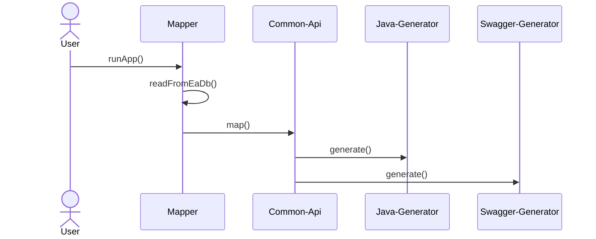
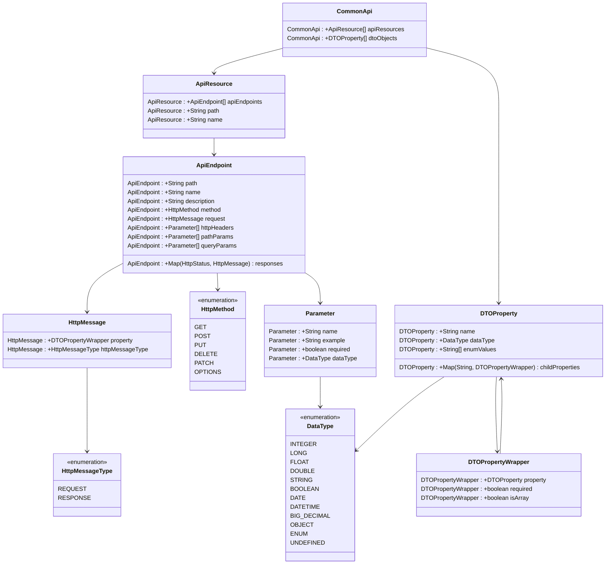

# Česká verze dokumentace

## Základní informace
Tato aplikace slouží k generování kódu z Enterprise Architect modelů. Je plně konfigurovatelné, lze si dopsat vlastní mappery a vlastní generovací profily.
Aplikace již obsahuje generátory pro Java (SpringBoot), Swagger a Avro schema. Je navržena jako SpringBoot starter aplikace.

<strong>Uživatel si vždy musí napsat svůj vlastní mapper!</strong>

## Požadavky na použití
* Java verze 17 nebo vyšší
* SpringBoot verze 3 nebo vyšší
* Maven

## Komponenty

### Common-api
Common-api je model, který slouží jako mezivrstva mezi EA modely a profily generátoru. Jeho účel je, aby profil generátoru byl nezávislý na pravidlech modelování v EA.

