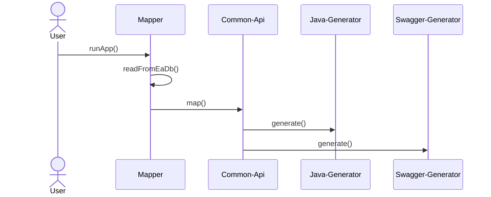
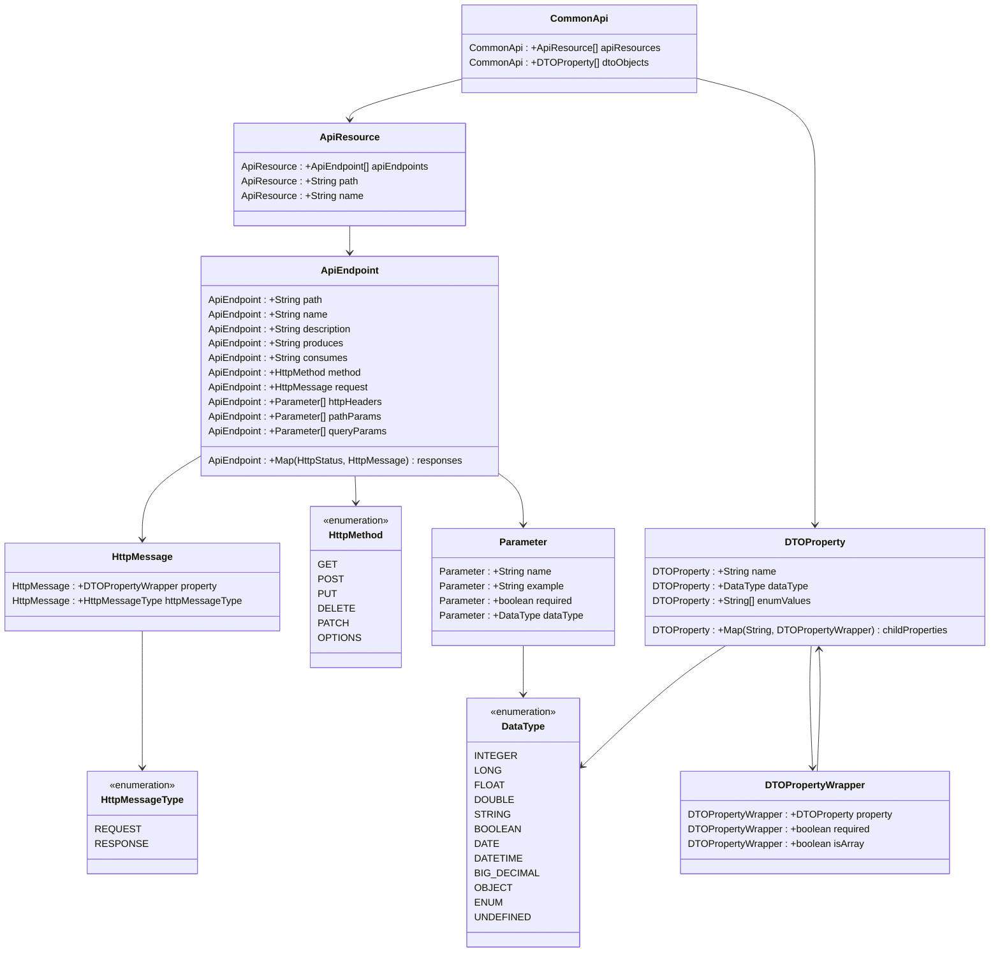

# Česká verze dokumentace

# Obsah
* [Základní informace](#základní-informace)
* [Kroky ke spuštění aplikace](#kroky-ke-spuštění-aplikace)
* [Požadavky na použití](#požadavky-na-použití)
* [Konfigurační soubor](#konfigurační-soubor)
* [Komponenty](#komponenty)
  * [Common-api](#common-api)
  * [Mapper](#mapper)
  * [Generátory](#generátory)
* [Existující generátory](#existující-generátory)
  * [Java SpringBoot](#java-springBoot)
  * [Swagger](#swagger)
  * [AvroSchema](#avroSchema)

## Základní informace

Tato aplikace slouží k generování kódu z Enterprise Architect modelů. Je plně konfigurovatelné, lze si dopsat vlastní
mappery a vlastní generovací profily.
Aplikace již obsahuje generátory pro Java (SpringBoot), Swagger a Avro schema. Je navržena jako SpringBoot starter
aplikace.


<strong>Uživatel si vždy musí napsat svůj vlastní mapper!</strong>

## Kroky ke spuštění aplikace
* Uživatel si přidal do pom.xml dependency na tento starter
* Uživatel si naimplementoval mapper
* Uživatel si připravil konfigurační .json soubor
* Uživatel spustil aplikaci s argumentem s cestou na konfigurační .json soubor

## Požadavky na použití

* Java verze 17 nebo vyšší
* SpringBoot verze 3 nebo vyšší
* Maven

## Konfigurační soubor
Konfigurační soubor je ve formátu JSON a vypadá následovně:
```json
{
  "databaseConnection": {
    "url" : "DB_URL",
    "user": "DB_USER",
    "password": "DB_PASSWORD"
  },
  "mappingConfiguration": {
    "type": "custom",
    "profile": "test-mapper"
  },
  "eaStartPackage": "Api.TestPath",
  "version": "1.0.0",
  "enabledGenerators": [
    "generator-a",
    "generator-b",
    "generator-c"
  ],
  "javaSpring": {

  },
  "swagger": {

  },
  "parameters": {
  }
}
```
| Atribut                      |                               Popis                               | Povinnost |
|------------------------------|:-----------------------------------------------------------------:|----------:|
| databaseConnection.url       |                        JDBC k EA databázi                         |   &check; |
| databaseConnection.user      |                    username pro připojení k DB                    |   &check; |
| databaseConnection.password  |                     heslo pro připojení k DB                      |   &check; |
| mappingConfiguration.type    |            typ mapování (v tuto chvíli vždy = "custom"            |   &check; |
| mappingConfiguration.profile |         název mapperu (odpovídá názvu v anotaci @Mapper)          |   &check; |
| eaStartPackage               |                      Umístění diagramu v EA                       |   &check; |
| version                      |                     Verze výstupních souborů                      |   &check; |
| enabledGenerators            | Seznam zapnutých generátorů (odpovídá názvu v anotaci @Generator) |   &check; |
| javaSpring                   |        Parametrizace vestavěného generátoru "java-spring"         |   &cross; |
| swagger                      |          Parametrizace vestavěného generátoru "swagger"           |   &cross; |
| parameters                   |           Dodatečné parametry pro jednotlivé generátory           |   &cross; |

Parameters se vztahují k jednotlivým generátorům a jejich povinnost závisí dle zapnutého seznamu generátorů.


## Komponenty

### Common-api

Common-api je model, který slouží jako mezivrstva mezi EA modely a profily generátoru. Jeho účel je, aby profil
generátoru byl nezávislý na pravidlech modelování v EA.



### Mapper

Mapper je komponenta, která se stará o zpracování dat z EA databáze do standardizované common-api. Třída musí být
označena anotací a implementovat MapperHandler.

```java
import com.mmasata.eagenerator.MapperHandler;
import com.mmasata.eagenerator.annotations.Mapper;

@Mapper(name = "my-mapper")
public class MyMapper implements MapperHandler {

    @Override
    public List<ApiResource> mapApiResources() {
        //implement mapping to common-api ApiResources here
    }

    @Override
    public List<DTOProperty> mapDtoObjects() {
        //implement mapping to common-api DTOProperties here
    }
}
```

Přístup do databáze lze řešit vlastní implementací, nebo využít nadefinované JPA entity ve frameworku. JPA entity se
nacházejí v
<strong>"com.mmasata.eagenerator.database.entity"</strong> a pro jejich využití je nutné si zapnout anotaci <strong>
@EnableGeneratorJpaEntities</strong> - lze si dopsat vlastní JPA repository.

```java

@SpringBootApplication
@EnableGeneratorJpaEntities
public class MyApplication {

    public static void main(String[] args) {
        SpringApplication.run(MyApplication.class, args);
    }

}
```

### Generátory

Generátor je komponenta, která se stará o zpracování common-api do výsledných souborů. Třída musí být označena anotací a
implementovat GeneratorHandler.
K dispozici je také Beana FileProcessor, která se stará o zápis do souborů a práci s freemarker šablonami.

```java
import com.mmasata.eagenerator.GeneratorHandler;
import com.mmasata.eagenerator.annotations.Generator;
import com.mmasata.eagenerator.processor.FileProcessor;
import lombok.RequiredArgsConstructor;

import java.io.FileWriter;
import java.io.StringWriter;
import java.util.Map;

@Generator(name = "my-generator")
@RequiredArgsConstructor
public class MyGenerator implements GeneratorHandler {

    private final FileProcessor fileProcessor;

    @Override
    public void run() {
        //implement generator logic here
        Writer fileData = new StringWriter();
        fileProcessor.generate("myFile.txt", fileData);
    }

}
```

## Existující generátory
Framework v sobě obsahuje několik zabudovaných generátorů, které lze spustit.

### Java SpringBoot
| Název                                      |                                 Popis                                 |
|--------------------------------------------|:---------------------------------------------------------------------:|
| <strong>java-spring</strong>               |                           Název generátoru                            |
| javaSpring.controllerType                  |             typ Rest controllerů (REACTIVE nebo STANDARD)             |
| javaSpring.defaultEndpointMediaType                  | defaultní MediaType consumes/produces, pokud není žádná jiná vyplněná |
| javaSpring.dtoType                         |                typ modelů (třídy s LOMBOK či RECORDS)                 |
| javaSpring.packageName                     |               root package vygenerovaných java souborů                |
| javaSpring.pom                             |                    Objekt s informacemi o pom.xml                     |
| javaSpring.pom.name                        |                     název vygenerovaného projektu                     |
| javaSpring.pom.javaVersion                 |                              verze javy                               |
| javaSpring.pom.groupId                     |                    groupId vygenerovaného projektu                    |
| javaSpring.pom.artifactId                  |                  artifactId vygenerovaného projektu                   |
| javaSpring.pom.distributionManagement[]    |                            Pole repositářů                            |
| javaSpring.pom.distributionManagement.type |   Typ distribučního repositáře (snapshotRepository nebo repository)   |
| javaSpring.pom.distributionManagement.id   |                      ID distribučního repositáře                      |
| javaSpring.pom.distributionManagement.url  |                  URL adresa distribučního repositáře                  |
| javaSpring.pom.repositories[]              |                            Pole repositářů                            |
| javaSpring.pom.repositories.name           |                           Jméno repositáře                            |
| javaSpring.pom.repositories.id             |                             ID repositáře                             |
| javaSpring.pom.repositories.url            |                         URL adresa repositáře                         |
| javaSpring.pom.pluginRepositories[]              |                        Pole plugin repositářů                         |
| javaSpring.pom.pluginRepositories.name           |                        Jméno plugin repositáře                        |
| javaSpring.pom.pluginRepositories.id             |                         ID plugin repositáře                          |
| javaSpring.pom.pluginRepositories.url            |                     URL adresa plugin repositáře                      |

### Swagger
| Název                    |                  Popis                  |
|--------------------------|:---------------------------------------:|
| <strong>swagger</strong> |            Název generátoru             |
| swagger.title            | Název vygenerovaného swaggeru dokumentu |

### AvroSchema
| Název                                       |                  Popis                  |
|---------------------------------------------|:---------------------------------------:|
| <strong>avro-schema</strong>                    |            Název generátoru             |