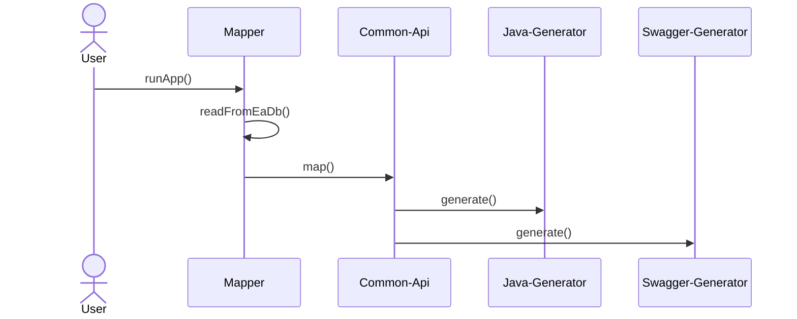

# English version of documentation

# Table of Contects
* [Basic information](#basic-information)
* [Steps to launch the application](#steps-to-launch-the-application)
* [Application requirements](#application-requirements)
* [Config file](#config-file)
* [Components](#components)
    * [Common-api](#common-api)
    * [Mapper](#mapper)
    * [Generators](#generators)
* [Embedded generators](#embedded-generators)
    * [Java SpringBoot](#java-springBoot)
    * [Swagger](#swagger)
    * [AvroSchema](#avroSchema)

## Basic information
This application is used to generate code from Enterprise Architect models. It is fully configurable, you can write your own mappers and custom generation profiles.
The application already includes generators for Java (SpringBoot), Swagger and Avro schema. It is designed as a SpringBoot starter application.



<strong>The user must always write their own mapper!</strong>

## Steps to launch the application
* User has added a dependency to pom.xml for this starter
* User has implemented the mapper
* User prepared a .json configuration file
* User started the application with an argument with a path to the .json configuration file

## Application requirements
* Java version 17 or higher
* SpringBoot version 3 or higher
* Maven

## Config file
The configuration file is in JSON format and looks like this:
```json
{
  "databaseConnection": {
    "url" : "DB_URL",
    "user": "DB_USER",
    "password": "DB_PASSWORD"
  },
  "mappingConfiguration": {
    "type": "custom",
    "profile": "test-mapper"
  },
  "eaStartPackage": "Api.TestPath",
  "version": "1.0.0",
  "enabledGenerators": [
    "generator-a",
    "generator-b",
    "generator-c"
  ],
  "javaSpring": {
    
  },
  "swagger": {
    
  },
  "parameters": {
  }
}
```

| Attribute |                                    Description                                    | Obligation |
|-----------------------------|:---------------------------------------------------------------------------------:|----------:|
| databaseConnection.url |                                JDBC to EA database                                | &check; |
| databaseConnection.user |                            username for DB connection                             | &check; |
| databaseConnection.password |                            password for DB connection                             | &check; |
| mappingConfiguration.type |                   mapping type (at the moment always = "custom"                   | &check; |
| mappingConfiguration.profile |          mapper name (corresponds to the name in the @Mapper annotation)          | &check; |
| eaStartPackage |                           Location of the diagram in EA                           | &check; |
| version |                              Version of output files                              | &check; |
| enabledGenerators | List of enabled generators (corresponds to the name in the @Generator annotation) | &check; |
| javaSpring                   |             Parameterization of the built-in "java-spring" generator              |   &cross; |
| swagger                      |               Parameterization of the built-in "swagger" generator                |   &cross; |
| parameters |                  Additional parameters for individual generators                  | &cross; |

Parameters refer to individual generators and their obligation depends on the enabled generator list.

## Components

### Common-api
Common-api is a model that serves as an intermediate layer between EA models and generator profiles. Its purpose is to make the generator profile independent of the EA modeling rules.


### Mapper
The mapper is a component that handles the processing of data from the EA database into a standardized common-api. The class must be annotated and implement a MapperHandler.
```java
import com.mmasata.eagenerator.MapperHandler;
import com.mmasata.eagenerator.annotations.Mapper;

@Mapper(name = "my-mapper")
public class MyMapper implements MapperHandler {

    @Override
    public List<ApiResource> mapApiResources() {
        //implement mapping to common-api ApiResources here
    }

    @Override
    public List<DTOProperty> mapDtoObjects() {
        //implement mapping to common-api DTOProperties here
    }
}
```
Access to the database can be handled by custom implementation or by using JPA entities defined in the framework. JPA entities are located in
<strong>"com.mmasata.eagenerator.database.entity"</strong> and to use them you need to enable the <strong>@EnableGeneratorJpaEntities</strong> annotation - you can write your own JPA repository.
```java
@SpringBootApplication
@EnableGeneratorJpaEntities
public class MyApplication {

    public static void main(String[] args) {
        SpringApplication.run(MyApplication.class, args);
    }

}
```

### Generators
The generator is the component that handles the processing of the common-api into the resulting files. The class must be annotated and
implement a GeneratorHandler.
There is also a Beana FileProcessor that takes care of writing to files and working with freemarker templates.
```java
import com.mmasata.eagenerator.GeneratorHandler;
import com.mmasata.eagenerator.annotations.Generator;
import com.mmasata.eagenerator.processor.FileProcessor;
import lombok.RequiredArgsConstructor;

import java.io.FileWriter;
import java.io.StringWriter;
import java.util.Map;

@Generator(name = "my-generator")
@RequiredArgsConstructor
public class MyGenerator implements GeneratorHandler {

    private final FileProcessor fileProcessor;

    @Override
    public void run() {
        //implement generator logic here
        Writer fileData = new StringWriter();
        fileProcessor.generate("myFile.txt", fileData);
    }

}
```

## Embedded generators
The framework contains several built-in generators that can be run.

### Java SpringBoot
| Název                                      |                              Popis                              |
|--------------------------------------------|:---------------------------------------------------------------:|
| <strong>java-spring</strong>               |                        Name of generator                        |
| javaSpring.controllerType                  |         Type of Rest Controllers (REACTIVE or STANDARD)         |
| javaSpring.dtoType                         |            Model type (class with LOMBOK or RECORDS)            |
| javaSpring.packageName                     |              Root package of generated java files               |
| javaSpring.pom                             |              Object with information about pom.xml              |
| javaSpring.pom.name                        |                  Name of the generated project                  |
| javaSpring.pom.javaVersion                 |                         Version of Java                         |
| javaSpring.pom.groupId                     |                  groupId of generated project                   |
| javaSpring.pom.artifactId                  |                 artifactId of generated project                 |
| javaSpring.pom.distributionManagement[]    |                      Array of repositories                      |
| javaSpring.pom.distributionManagement.type | Distribution repository type (snapshotRepository or repository) |
| javaSpring.pom.distributionManagement.id   |                  ID of distribution repository                  |
| javaSpring.pom.distributionManagement.url  |             URL address of distribution repository              |
| javaSpring.pom.repositories[]              |                      Array of repositories                      |
| javaSpring.pom.repositories.name           |                       Name of repository                        |
| javaSpring.pom.repositories.id             |                        ID of repository                         |
| javaSpring.pom.repositories.url            |                    URL address of repository                    |
| javaSpring.pom.pluginRepositories[]              |                  Array of plugin repositories                   |
| javaSpring.pom.pluginRepositories.name           |                    Name of plugin repository                    |
| javaSpring.pom.pluginRepositories.id             |                     ID of plugin repository                     |
| javaSpring.pom.pluginRepositories.url            |                URL address of plugin repository                 |

### Swagger
| Name                                       |            Description             |
|---------------------------------------------|:----------------------------------:|
| <strong>swagger</strong>                    |         Name of generator          |
| swagger.title  | Name of generated swagger document |

### AvroSchema
| Name                                       |    Description    |
|---------------------------------------------|:-----------------:|
| <strong>avro-schema</strong>                    | Name of generator |