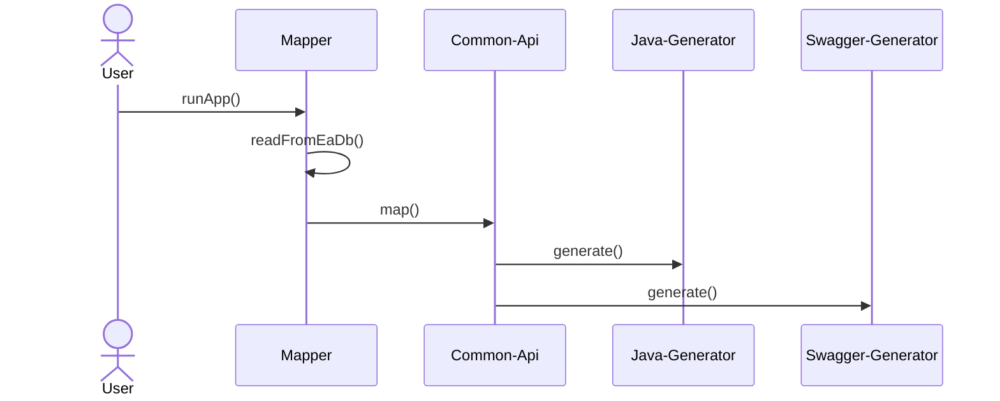
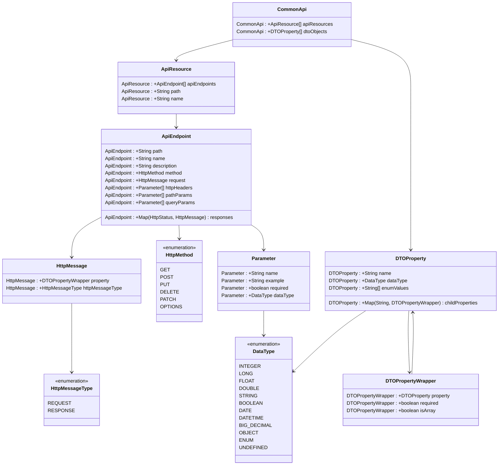

# English version of documentation

## Basic information
This application is used to generate code from Enterprise Architect models. It is fully configurable, you can write your own mappers and custom generation profiles.
The application already includes generators for Java (SpringBoot), Swagger and Avro schema. It is designed as a SpringBoot starter application.

<strong>The user must always write their own mapper!</strong>

## Application requirements
* Java version 17 or higher
* SpringBoot version 3 or higher
* Maven

## Components

### Common-api
Common-api is a model that serves as an intermediate layer between EA models and generator profiles. Its purpose is to make the generator profile independent of the EA modeling rules.
