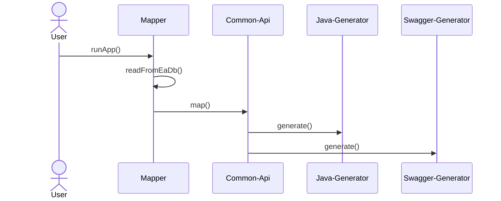

# English version of documentation

## Basic information
This application is used to generate code from Enterprise Architect models. It is fully configurable, you can write your own mappers and custom generation profiles.
The application already includes generators for Java (SpringBoot), Swagger and Avro schema. It is designed as a SpringBoot starter application.



<strong>The user must always write their own mapper!</strong>

## Application requirements
* Java version 17 or higher
* SpringBoot version 3 or higher
* Maven

## Components

### Common-api
Common-api is a model that serves as an intermediate layer between EA models and generator profiles. Its purpose is to make the generator profile independent of the EA modeling rules.


### Mapper
The mapper is a component that handles the processing of data from the EA database into a standardized common-api. The class must be annotated and implement a MapperHandler.
```java
import com.mmasata.eagenerator.MapperHandler;
import com.mmasata.eagenerator.annotations.Mapper;

@Mapper(name = "my-mapper")
public class MyMapper implements MapperHandler {

    @Override
    public List<ApiResource> mapApiResources() {
        //implement mapping to common-api ApiResources here
    }

    @Override
    public List<DTOProperty> mapDtoObjects() {
        //implement mapping to common-api DTOProperties here
    }
}
```
Access to the database can be handled by custom implementation or by using JPA entities defined in the framework. JPA entities are located in
<strong>"com.mmasata.eagenerator.database.entity"</strong> and to use them you need to enable the <strong>@EnableGeneratorJpaEntities</strong> annotation - you can write your own JPA repository.
```java
@SpringBootApplication
@EnableGeneratorJpaEntities
public class MyApplication {

    public static void main(String[] args) {
        SpringApplication.run(MyApplication.class, args);
    }

}
```

### Generators
The generator is the component that handles the processing of the common-api into the resulting files. The class must be annotated and
implement a GeneratorHandler.
There is also a Beana FileProcessor that takes care of writing to files and working with freemarker templates.
```java
import com.mmasata.eagenerator.GeneratorHandler;
import com.mmasata.eagenerator.annotations.Generator;
import com.mmasata.eagenerator.processor.FileProcessor;
import lombok.RequiredArgsConstructor;

import java.io.FileWriter;
import java.io.StringWriter;
import java.util.Map;

@Generator(name = "my-generator")
@RequiredArgsConstructor
public class MyGenerator implements GeneratorHandler {

    private final FileProcessor fileProcessor;

    @Override

    public void run() {
        //implement generator logic here
        Writer fileData = new StringWriter();
        fileProcessor.generate("myFile.txt", fileData);
    }

}
```